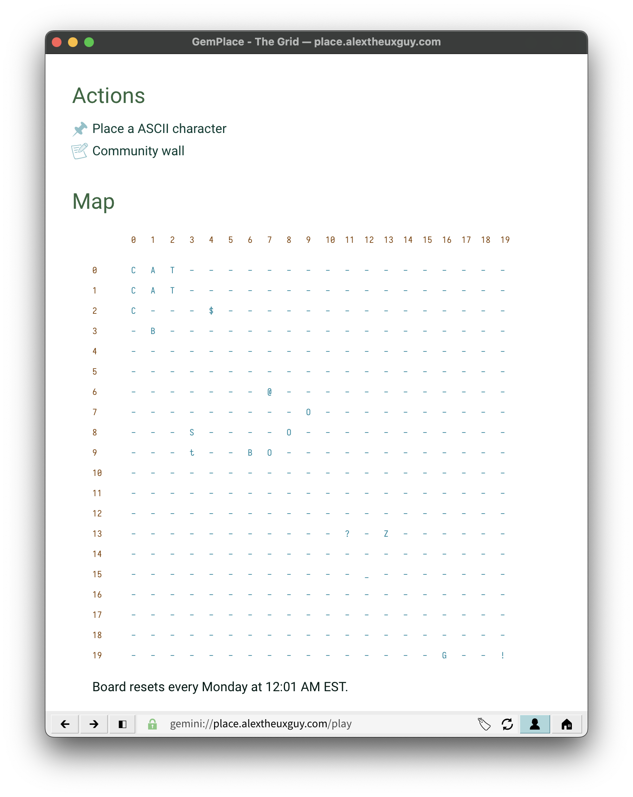

# GemPlace

A social experiment on the Gemini Protocol.

[View on Gemini](gemini://place.alextheuxguy.com)

GemPlace seeks to provide a similiar experience to the popular /r/place on Reddit. Users presented an ASCII grid and are able to change one character a day. The grid resets at midnight every Monday.

## Usage

Install dependencies with `npm install`. It's recommended to run the application with [pm2](https://pm2.keymetrics.io/docs/usage/quick-start/).

`pm2 start main.js`

You will need to forward port 1965 to the host computer, and set `HOST` in `main.js` to your proper hostname.

## How it works

GemPlace uses an SQL Lite database to store characters for each cell in the grid. The grid size is determined by the `MAP_SIZE` const in `map.js`. When a user places a character, the `map` table is updated, and the users `fingerprint` from their peer certificate is recorded in the `users` table, along with the current date. This allows us to restrict users to placing a single character a day.
